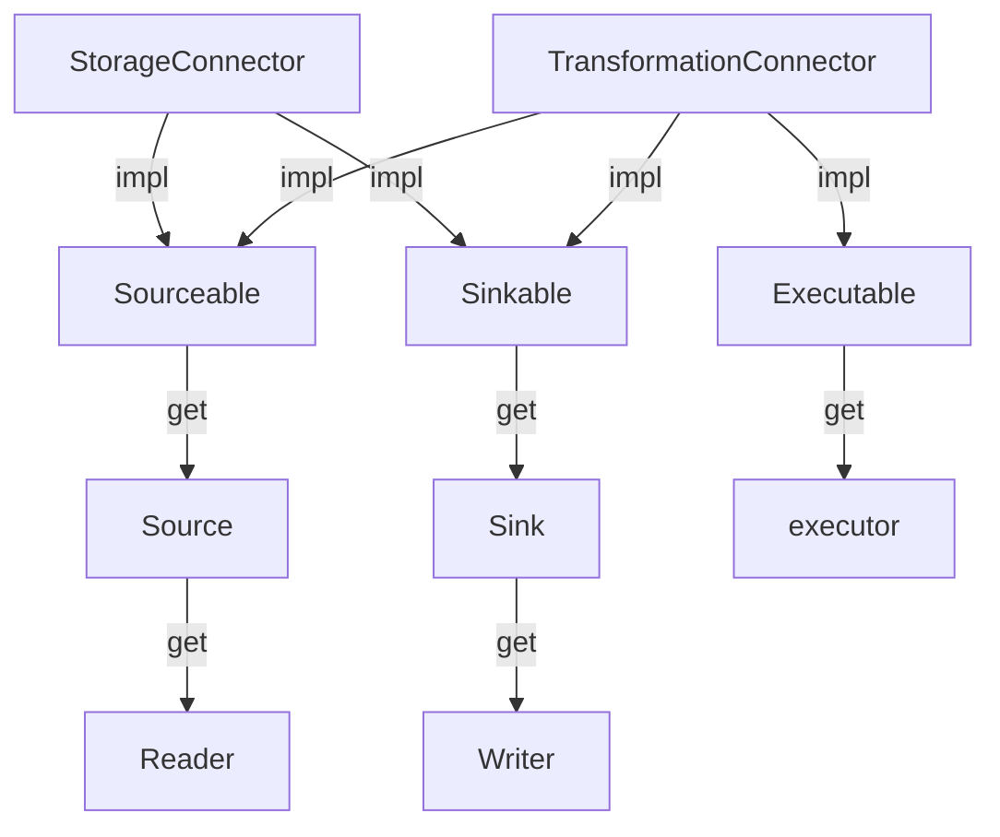

# Infra Connectors Design

## Interfaces

Refer to `src/infra/pi.rs` for details:



`Sink`: sink is a file location/handler/… where you can get a `Writer` from it.

`Source`: source is a handler where you can get a `Reader` from it.

`StorageConnector`: `Sinkable` + `Sourceable`

`TransformationConnector`: `Sinkable` + `Sourceable` + Executable

## Connectors

### kv

`RedisConnector`: `Sinkable` + `Sourceable`

### gdb

`Neo4jConnector`: `TransformationConnector`

## Demonstration workflow using `page_rank` (Neo4j -> Row -> Redis)

```mermaid
graph
 Neo4j .- Neo4jConnector;

 Neo4jConnector --get--> PageRankExecutor;
 PageRankExecutor --exec--> Neo4jQuerySource;
 PageRankExecutor --impl--> GraphComputationExecutor;
 GraphComputationExecutor .-> Neo4jQuerySource;
 Neo4jQuerySource --get--> Reader["Reader&lt;Row&gt;"];
 Neo4jQuerySource --impl--> Source["Source&lt;Row&gt;"];
 Source .-> Reader;

 Redis .- RedisConnector;
 RedisConnector --get--> RedisRowSink;
 RedisRowSink --impl--> Sink["Sink&lt;Row&gt;"]
 RedisRowSink --get--> Writer["Writer&lt;Row&gt;"];
 Sink .-> Writer;

 Reader .-data.-> Writer;
```
