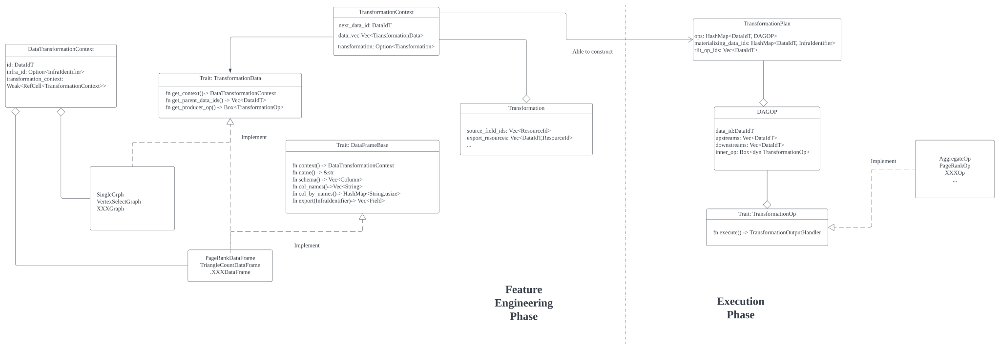

# Workflow of the transformation execution phase

This doc provides an explanation of the transformation workflow in Ofnil, containing three parts:

1. A brief explanation of transformation workflow, using page rank as an example.
2. User guide  
   - How to define a transformation  
   - How to access results in the sink infra  
3. Developer guide  
   - Relationship between dataframes and transformation ops
   - How to handle sources and sinks properly
   - How to add new built-in algorithms

## Introduction

Transformation is the process of transforming data. For example, to transform a graph into a feature vector. It defines a collection of closely related data transformation tasks. It is the stage to turn raw graph data into ready-for-ml serving data.

### 1. Pre-knowledge

Below are several important classes or concepts that you may want to know before moving forward:

1. `A high-level overview of the whole process`: You may want to go through the examples/quickstart/README.md for an overview of the whole process, including what happens before the transformation, when will the transformation be planned and when will the plan execute.

2. `ResourceOp & KV Store`: Almost all data you will need to use like the graph, FeatureView, Transformation, etc. are deemed as resources and will be given a unique key with the type ResourceId. Meanwhile, these data types implemented the ResourceOp Trait so you can get their keys by calling XXX.resource_id(). The ResourceId is a String and is used as the Key value in the feature registry (etcd).

3. `ResourceId` & `DataIdT`: `ResourceId` is used to identify data abstractions (e.g., a `VertexEntity` instance) in the registry, while `DataId`s identify data in a dataflow. For example, if all vertices with the label `Person` are needed, then they will be registered in the sink infra as a `VertexEntity` instance, a data abstraction, having a unique `ResourceId`. Meanwhile, `DataId` is used to identify a part of data that is used in a transformation dataflow. For example, a page rank transformation may need several `VertexEntity`s, and this data information will be stored in a `PageRankDataFrame` instance. The instance will be assigned a `DataId`, which can be used to retrieve the dataframe, and thus the data themselves. The logic before serving the features is: Register data using `ResourceId` -> store a batch of data information (e.g., what to transform, what kind of transformation will be deployed) in the dataframe. And when we try to retrieve the data to execute the transformation, we use `DataId` to retrieve the dataframe -> use the dataframe to retrieve the `ResourceId` -> Use the `ResourceId` to get the registered data abstractions (e.g., `VertexEntity`).

4. `TransformationContext`: Contains all data involved in a data flow and is used to construct transformation plans for data materialization. It stores the transformation operations, parent data, and the used infra (the database).

5. `SingleGraph` & `Graph` : `Graph` is a concept in Resource, while `SingleGraph` is a concept in Transformation.

A brief hierarchy structure of classes that are related to the Transformation phase:  



### 2. A step-by-step explanation of page_rank() transformation for a graph

Here we assume that all required resources are registered successfully.

Step 1: Turn a `Graph` into a `SingleGraph`. The `Graph` object defines the target graph or subgraph in the infra database (e.g.: what edges and vertices are involved in this engineering process) as well as the infra database's information (e.g., which database is the graph data stored).  

```Rust
// Note: Some code details here are discarded for better understanding
// fs : FeatureStore object 
// graph : Graph object 
let trans_context = TransformationContext::new();
let transform_graph : SingleGraph = graph
    .transform(
        &trans_context,
        &fs.registry,
    ).await?;
```

Step 2 : Initialize page_rank transformation and specify the sink infra to store the transformation outputs.

```Rust
// Initialize redis infra for later use
let redis_infra_id = InfraIdentifier::Redis("redis".to_string());
// Call page_rank transformation
let user_pagerank = transform_graph
    .page_rank(
        fs.registry
            .get_entities(vec![
                &"default/Entity/neo4j_reviewer".to_string(),
                &"default/Entity/neo4j_sameRates/neo4j_reviewer/neo4j_reviewer".to_string(),
                ]).await?,
        fs.registry
            .get_entity(&"default/Entity/neo4j_reviewer".to_string()).await?,
        None, // Damping factor, default: 0.85
        None, // Max iteration, default: 20
        None, // Tolerance, default: 1e-7

    )?
    .export(&redis_infra_id);
```

page_rank() will produce a `PageRankDataFrame` object containing essential information for this transformation, currently, each transformation is independent and the `DataFrame` only contains the information for one kind. Calling export() will store the data in the sink infra.

Step 3 : Register the transformation

```Rust
// This will return all the new fields you registered for further use.
finalize_transformation(
    fs,
    &trans_context,
    Vec::<&Entity>::new(),
    user_pagerank.iter().collect(),
    Vec::<&Topology>::new(),
    ).await?;
```

Step 4 : Create a dataset for serving

 This will create a dataset for you to use either for training or testing. The features and graph you defined will be allowed to serve after you defined the serving and finishing transformation execution.

```Rust
// fs: the FeatureStore object
// graph: the Graph object you registered at the very beginning
// fields: The new fields you obtained via calling export() in the previous phase (Step3), 
let dataset = graph_feature_serving(&fs, &graph, fields).await?; 
```

Step 5 : Transformation execution

The transformation will only start after calling deploy() like the following:

```Rust
// dataset: the DataSet object you obtained in Step 4
fs.deploy(dataset.resource_id()).await?;
```

After calling deploy(), the data involved in the transformation will be retrieved using `FeatureStore::get_transofrmations_of_view_items()`, in the format of HashMap, mapping from the transformation_id to Vec(resource_id, sink_infra_id), this means that we can find all data relating to a specific transformation using the map. After having the map, we execute each transformation independently. This is done by getting the `TransformationContext` of the transformation and constructing the `TransformationPlan` (recall that the Dataframe can produce its corresponding execution op). The plan contains ops that can execute the transformations (e.g.: the `TriangleCountOp`). During the process, the new graph will be created in the graph database while the new schemas, features, etc., will be stored in the sink infra.

## User guide

### 1. How to define a transformation

To define a transformation (what features to request, what kind of transformation to perform, etc.), you need to first get a `TransformationContext`, which will store all essential data needed for the transformation including requested data, dataframes, etc. You can get a new instance by calling the constructor:

```Rust
let trans_ctx = TransformationContext::new();
```

Then, you need to obtain source transformation data instances from resource definitions including `Graph`and `FeatureView`. For example, you may obtain a `SingleGraph` from `Graph` for applying graph transformations as follows.

```Rust
let transform_graph : SingleGraph = graph
    .transform(
        &trans_ctx,
        &fs.registry,
    ).await?;
```

To use a built-in transformation, you can use the transform_graph produced and the entities you registered to be the parameters of the functions. For a more detailed parameter list, please check the function definition. Here is the stage where you define your transformation including what entities to participate in, and what specific parameters to use in this transformation (for example, you can set the damping factor for the page_rank transformation listed below)

```Rust
let user_pagerank = transform_graph
    .page_rank(
        fs.registry
            .get_entities(vec![
                &"default/Entity/neo4j_reviewer".to_string(),
                &"default/Entity/neo4j_sameRates/neo4j_reviewer/neo4j_reviewer".to_string(),
            ]).await?,
        fs.registry
            .get_entity(&"default/Entity/neo4j_reviewer".to_string())
            .await?,
        None, // Damping factor, default: 0.85
        None, // Max iteration, default: 20
        None, // Tolerance, default: 1e-7
    )?
    .export(&redis_infra_id);
```

Calling page_rank directly will produce a corresponding DataFrame object, here the `PageRankDataFrame`. You will need to use export() to register the dataframe in a sink infra, here the redis, for further use. export() will return a vector of new fields produced, and you can use these fields to register and finalize the transformation. The `DataFrame` is like an execution blueprint, containing the corresponding `TaransformationContext`, the feature schema, and has the ability to reconstruct the `TransformationOp` that can deploy the transformation.

To register the newly produced fields and all related data of PageRank operation, call:

```Rust
finalize_transformation(
    fs,
    &trans_ctx,
    Vec::<&Entity>::new(),
    user_pagerank.iter().collect(),
    Vec::<&Topology>::new(),
    ).await?;
```

This function will register the entities, features and the transformation into the `FeatureStore`. You may find the `fn graph_feature_engineering()` of `examples/quickstart/main.rs` helpful.

### 2. How to access results in the sink infra

You may refer to the python script `examples/quickstart/example.py` for better reference.
First you will need a `ofnil::Client` object to access:

```python
client = ofnil.Client(</path/to/ofnil/home>)
```

Then you can get the data via the data loader:

```python
loader = client.get_neighbor_sampled_dataloader(
    topo="<resouce_id_of_topology_feature_view>", 
    features=[],
    batch_size=<batch_size_of_data_loader>,
    backend = ... # (Default value : "torch")
    hop_collector = ... # (Default value : None)
    # Etra arguments to be passed:
    <extra_arguments>
    # e.g.: fan_outs=[10, 5],
    # input_nodes="Reviewer",
    # edge_types=["sameRates", "rates"], 
    )
```

|Parameters|Meaning|
|------|---------------|
|topo|The resource id of the topology feature view to be used in the data loader.|
|features|A list of resource ids of the table feature views to be used in the data loader.|
|batch_size|The batch size of the data loader.|
|backend|The backend of the NeighborSampledDataLoader to be constructed, by default "torch"|
|hop_collector|The hop collector used to produce the sampled subgraph for specific output format.|
|kwargs(Extra arguments)|Additional arguments to be passed to the NeighborSampledDataLoader.|

If you want to directly access some of the resources like `FeatureView` and `Feature`, you can also call

```python
fv = client.get_feature_view(view_id: str):

features = fv.get[<entity_id_list>]
```

After getting the `FeatureView`, you can access the features using entity ids. For more comprehensive and detailed accessing methods, you may refer to `python/ofnil/client.py`.

## Developer guide

### 1. Relationship between dataframes and transformation ops

Simply put, `DataFrame` is like a plan for execution and `TransformationOps` is the executor.

Transformation ops are used to execute the transformation task and Dataframes are like the metadata that can be used to construct the ops. When using a transformation graph like `SingleGraph` to transform and execute, we are actually producing the Dataframes for the corresponding transformation operations. We first register the `Dataframes` for a series of Transformation ops and build up the TransformationPlan using get_produce_op() method during the deployment stage. For a better understanding, one can go check the hierarchy structure part in Introduction.

### 2. How to handle sources and sinks properly

Source infra: Databases that are used to store graph data. For example, if we store the real graph data in the Neo4j, then Neo4j can be a source infra.

Sink Infra: Databases that are used to store the produced feature schema, metadata, entities, etc. For example, the transformation context of the resulting features.

### 3. How to add new built-in transformation step-by-step

Example: To add a new built-in transformation for the triangle counting  
Checklist:

- [ ] **Implement triangle_count_op.rs.**  
  Step 1: Define the essential fields for the new transformation op

    ```Rust
    pub struct TriangleCountOp {
        pub nodes: Vec<(String, String)>,

        pub edges: Vec<String>,

        pub target_node: (String, String), // (node_label, primary_key)

        pub op_name: String,
    }
    ```  

  Step 2:  Implement TransformationOp trait for the new op (major logic)

- [ ] Add  the new crate information for the new op:

    ```Rust
    // File: src/transformation/transformation_plan.rs
    mod triangle_count_op;
    pub use triangle_count_op::TriangleCountOp;
    ```

- [ ] **Implement the corresponding dataframe for the new op**  
  Step 1 : Define the new Dataframe struct  

    ```Rust
    pub struct TriangleCountDataFrame {
        pub context: DataTransformationContext,
        pub name: String,
        pub schema: Vec<Rc<Column>>, // from meta or transformation
        pub col_names: Vec<String>,  // from meta or transformation
        pub col_by_names: HashMap<String, usize>,
        pub entities: Vec<Entity>, // the entities needed in graph projection
        pub target_node_entity: Entity, // the target node entity that we want to compute the PageRank
        pub parent_data_ids: Vec<DataIdT>, // to implement `TransformationData`
    }
    ```  

    Step 2 : Implement DataFrameBase trait for the new DataFrame. Here you should implement how to return the fields and how to export the dataframe content in a vector format

    ```Rust
    impl DataFrameBase for TriangleCountDataFrame {
        ....
    }
    ```

    Step 3 : Implement TransformationData trait for the new DataFrame. Here you should implement how to return the original operator (the operator that produced the dataframe) and parent data

    ```Rust
    impl TransformationData for TriangleCountDataFrame {
        ....
    }
    ```

- [ ] Modify the corresponding part in graph.rs  
    Step 1 : Add a new dataframe in the trait declaration  
    Step 2 : Add transformation function declaration in **GraphComputationOps** trait

    ```Rust
    // File : src/graph.rs
    pub trait GraphComputationOps {
        ....
        fn triangle_count(
        &self,
        entities: Vec<Entity>,
        target_node_entity: Entity,
    ) -> Result<Rc<TriangleCountDataFrame>, Box<dyn Error>>;
    ....
    }
    ```  

    Step 4 : Implement the previous declaration for GraphBase and TransformationData

    ```Rust
    impl<T: GraphBase + TransformationData> GraphComputationOps for T {
        fn triangle_count(
        &self,
        entities: Vec<Entity>,
        target_node_entity: Entity,
    ) -> Result<Rc<TriangleCountDataFrame>, Box<dyn Error>> {....}
    }
    ```
